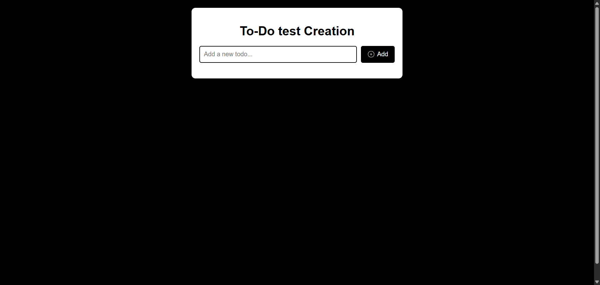
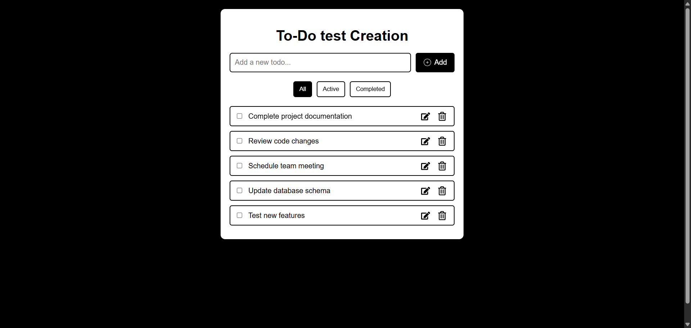
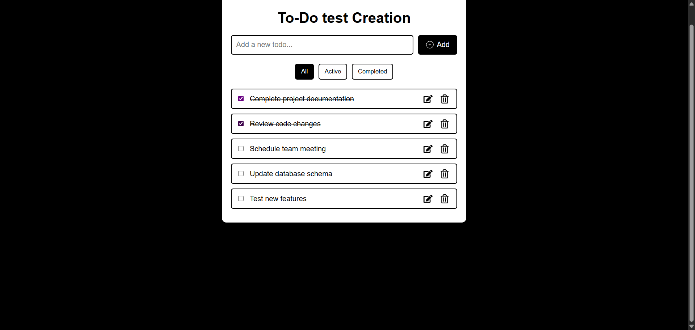
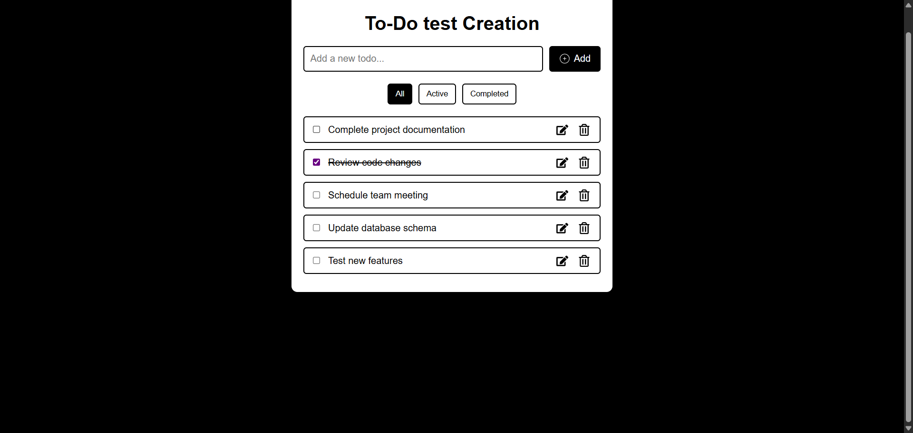
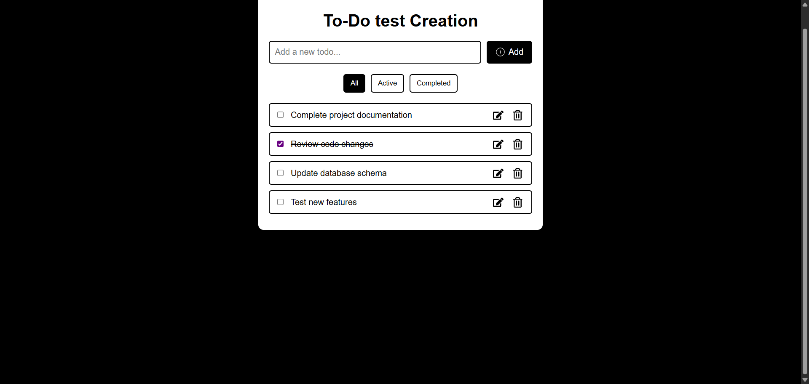
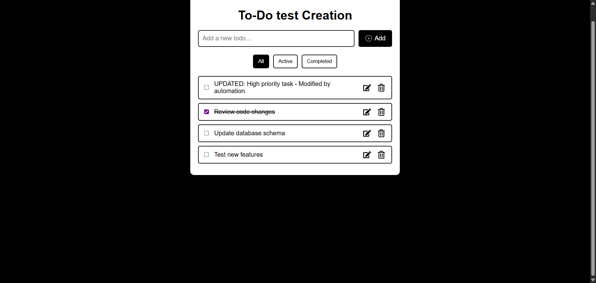
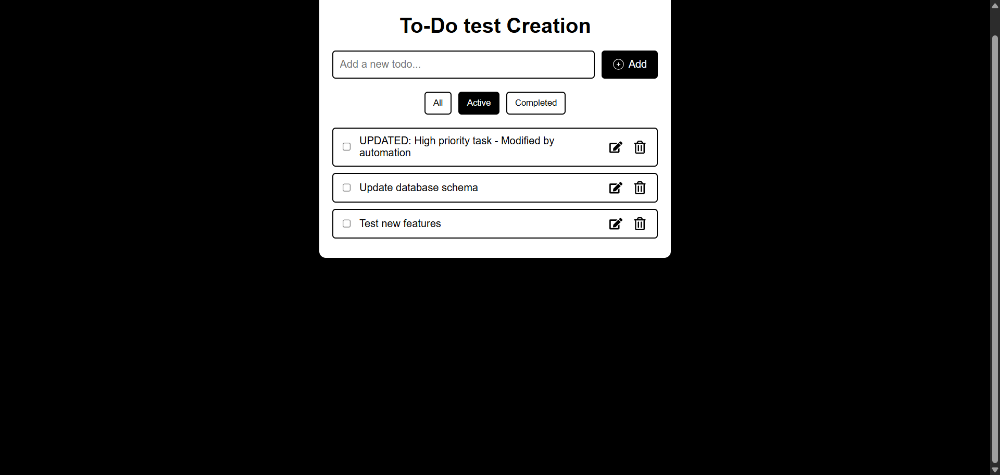
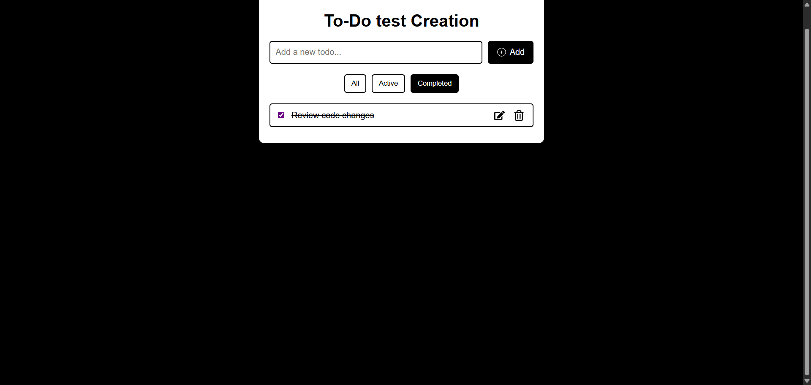

# React Todo Application with Test Automation

A modern, responsive Todo application built with React, featuring comprehensive Selenium Python test automation.

## 📱 Application Features

- ✅ Add, edit, and delete todos
- ✅ Mark todos as complete/incomplete
- ✅ Filter todos by status (All, Active, Completed)
- ✅ Persistent data storage using localStorage
- ✅ Responsive design with modern UI
- ✅ Custom hooks for state management
- ✅ Comprehensive test automation suite

## 🚀 Quick Start

### Prerequisites

- **Node.js 14+** and **npm** installed
- **Python 3.7+** (for test automation)
- **Google Chrome** browser (for test automation)

### Running the Application

1. **Install dependencies:**
   ```bash
   npm install
   ```

2. **Start the development server:**
   ```bash
   npm start
   ```
   
   The app will open at [http://localhost:3000](http://localhost:3000)

3. **Build for production:**
   ```bash
   npm run build
   ```

## 🧪 Test Automation

This project includes a comprehensive Selenium Python test automation suite located in the `test_automation/` directory.

### 📋 Test Scenario

The automation performs the following actions:

1. **Add 5 Todo Items**
   - Complete project documentation
   - Review code changes
   - Schedule team meeting
   - Update database schema
   - Test new features

2. **Manage Todo Status**
   - Mark todo #1 as completed
   - Mark todo #2 as completed  
   - Mark todo #1 back to active

3. **Delete Todo**
   - Delete todo #3

4. **Update Todo**
   - Update todo #1 with new text

5. **Test Filters**
   - Test "All" filter
   - Test "Active" filter
   - Test "Completed" filter

### 🔧 Test Automation Setup

1. **Navigate to the test automation directory:**
   ```cmd
   cd test_automation
   ```

2. **Run the setup script:**
   ```cmd
   setup.bat
   ```
   This will:
   - Create a Python virtual environment
   - Install required packages (Selenium, WebDriver Manager)
   - Set up the testing environment

### 🏃‍♂️ Running Tests

1. **Start your React app first:**
   ```cmd
   npm start
   ```
   Wait for the app to be available at `http://localhost:3000`

2. **Run the test automation:**
   ```cmd
   cd test_automation
   venv\Scripts\activate
   python todo_automation_advanced.py
   ```

   Or use the convenient runner:
   ```cmd
   cd test_automation
   run_tests.bat
   ```

## 📁 Project Structure

```
my-app/
├── public/                     # Static files
├── src/
│   ├── components/
│   │   └── Todo/
│   │       ├── TodoList.js     # Main Todo component
│   │       ├── hooks/          # Custom React hooks
│   │       │   ├── add.js      # Add todo functionality
│   │       │   ├── change.js   # Toggle todo status
│   │       │   ├── delete.js   # Delete todo functionality
│   │       │   └── todosReducer.js # State management
│   │       └── styles/
│   │           └── TodoList.css # Component styling
│   ├── App.js                  # Main App component
│   └── index.js               # App entry point
├── test_automation/           # Test automation suite
│   ├── todo_automation.py # Enhanced test script
│   ├── requirements.txt       # Python dependencies
│   ├── logs/                 # Test execution logs
│   └── screenshots/          # Test screenshots
└── package.json              # Node.js dependencies
```

## 📊 Test Automation Output

The automation will:

- **Generate logs** in the `test_automation/logs/` directory
- **Take screenshots** at key points in the `test_automation/screenshots/` directory
- **Display real-time progress** in the console
- **Provide detailed statistics** at the end

### Sample Output:
```
=== Starting Todo Application Test Automation ===
[OK] Todo application loaded successfully
--- Adding 5 Todo Items ---
[OK] Added todo: 'Complete project documentation'
[OK] Added todo: 'Review code changes'
...
--- Final Test Results ---
Total todos: 4
Active todos: 3
Completed todos: 1
--- Automation Statistics ---
Todos added: 5
Todos completed: 2
Todos deleted: 1
Todos updated: 1
Errors encountered: 0
```

## 📸 Test Automation Screenshots

The automation captures screenshots at key points during test execution to document the application's behavior:

### 1. Initial State

*Empty todo application ready for testing*

### 2. After Adding Todos

*Five todos successfully added to the application*

### 3. After Completing Todos

*First two todos marked as completed*

### 4. After Making Todo Active

*First todo changed back to active status*

### 5. After Deletion

*Third todo successfully deleted*

### 6. After Update

*First todo updated with new text*

### 7. Filter: All Todos

*All todos displayed (both active and completed)*

### 8. Filter: Active Todos

*Only active todos displayed*

### 9. Filter: Completed Todos

*Only completed todos displayed*

### 10. Final State

*Final application state after all test operations*

## 🎯 Test Coverage

The automation tests:
- ✅ Adding multiple todos
- ✅ Toggling todo completion status
- ✅ Deleting todos
- ✅ Updating/editing todos
- ✅ Filter functionality (All, Active, Completed)
- ✅ UI interactions and responsiveness
- ✅ Data persistence verification

## 🐛 Troubleshooting

### Application Issues:

1. **Port already in use:**
   - Kill the process using port 3000: `npx kill-port 3000`
   - Or use a different port: `PORT=3001 npm start`

2. **Dependencies issues:**
   - Clear cache: `npm cache clean --force`
   - Delete node_modules: `rm -rf node_modules && npm install`

### Test Automation Issues:

1. **"Chrome driver not found"**
   - The script uses WebDriver Manager to auto-download Chrome driver
   - Ensure you have internet connection

2. **"Application not found"**
   - Make sure your React app is running on `http://localhost:3000`
   - Check if the port is different and update `TODO_APP_URL` in the test scripts

3. **"Element not found"**
   - The app might be loading slowly
   - Increase `WAIT_TIMEOUT` value in the test scripts

4. **"Permission denied"**
   - Run Command Prompt as Administrator
   - Check if antivirus is blocking Selenium

## 📈 Performance

- **Application:** Fast React performance with optimized hooks
- **Test Automation:** 30-45 seconds average execution time
- **Browser:** Chrome (latest version) with automated driver management
- **Screenshots:** Automatically captured at key test steps
- **Logs:** Detailed execution logs with timestamps

## 🔄 Continuous Integration

To run the test automation in CI/CD, modify the Chrome options in the test scripts:

```python
chrome_options.add_argument("--headless")
chrome_options.add_argument("--no-sandbox")
chrome_options.add_argument("--disable-dev-shm-usage")
```

## 🛠️ Technology Stack

- **Frontend:** React 19.1.1, React Icons, CSS3
- **State Management:** useReducer with custom hooks
- **Storage:** localStorage for data persistence
- **Testing:** Selenium WebDriver, Python
- **Automation:** WebDriver Manager for automatic driver management

## 📚 Available Scripts

In the project directory, you can run:

### `npm start`
Runs the app in development mode at [http://localhost:3000](http://localhost:3000)

### `npm test`
Launches the test runner in interactive watch mode

### `npm run build`
Builds the app for production to the `build` folder

### `npm run eject`
**Note: this is a one-way operation. Once you `eject`, you can't go back!**

## 📖 Learn More

- [Create React App documentation](https://facebook.github.io/create-react-app/docs/getting-started)
- [React documentation](https://reactjs.org/)
- [Selenium documentation](https://selenium-python.readthedocs.io/)
- [WebDriver Manager](https://github.com/SergeyPirogov/webdriver_manager)
